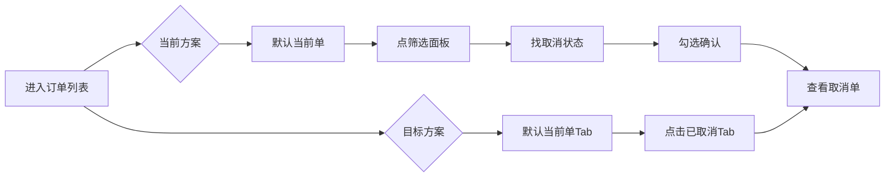

# 1. 执行摘要
优化骑手订单列表筛选，支持查看已取消及历史订单。核心矛盾：提升查单可达性同时不干扰高频接单浏览。推荐方案：默认列表保持现状排除已取消，顶部增加独立Tab切换“已取消”与“历史全部”。需拍板争议：默认态定义、历史查询口径、取消类型细分程度。预期收益：降低相关客服咨询率；范围：骑手App订单列表页；不做：全站订单系统重构与复杂搜索系统。

# 2. 背景与问题定义
当前顶部筛选致查单受阻，具体影响：

| 反馈痛点 | 可验证问题 | 影响 |
|---|---|---|
| 筛选不好用 | 筛选项层级深，操作步骤多 | 增加骑手行驶中操作风险 |
| 找不到已取消单 | 默认筛选排除已取消状态，且无直接入口 | 骑手无法核对客责扣款，引发客诉 |
| 看不到历史订单 | 列表仅展示近期待完成单，无全量查看路径 | 历史纠纷无证可查 |

核心场景：1)核对被取消订单；2)回查历史订单。限定范围：骑手App订单列表页，不扩展全站。

# 3. 目标、范围与非目标
**目标**：
1. 支持“已取消”订单查看
2. 支持“全部历史”订单查看
3. 默认接单主流程0感知0干扰

**范围与非目标**：

| 分类 | 内容 |
|---|---|
| 本期范围 | 列表页顶部筛选改造、增加筛选项、定义状态映射、接口分页适配 |
| 本期非目标 | 复杂搜索系统、整页信息架构重做、接单业务规则改动 |

**“不影响主流程”可验证约束**：

| 约束项 | 验证标准 |
|---|---|
| 默认列表内容 | 默认进入列表展示的订单集合与旧版完全一致(不含已取消) |
| 默认筛选态 | 顶部默认选中“当前进行”Tab，无额外筛选条件 |
| 关键操作链路 | 接单、取餐、送达操作路径与点击次数不变 |

# 4. 用户场景与流程对比

**场景对比**：

| 场景 | 当前路径步骤 | 目标路径步骤 | 点击减少 | 认知负担变化 |
|---|---|---|---|---|
| 查客户取消单 | 进入页->点筛选->找状态->勾选->确认 (5步) | 进入页->点“已取消”Tab (2步) | -3 | 从“搜索式”变“直达式” |
| 回看历史订单 | 不可达 | 进入页->点“历史全部”Tab (2步) | - | 无变有 |
| 查单后回当前 | 反向操作取消筛选 (3步) | 点“当前进行”Tab (1步) | -2 | 明确切换，无路径迷失 |

**状态保留规则**：

| 操作 | 筛选状态保留策略 |
|---|---|
| 切换至其他页面后返回 | 重置为默认“当前进行”Tab |
| 下拉刷新 | 保留当前Tab，刷新列表数据 |
| 杀进程重新进入 | 重置为默认“当前进行”Tab |

# 5. 产品方案与交互规则
顶部筛选形态采用**Tab标签组**（当前进行 | 已取消 | 历史全部），替代原下拉筛选面板。理由：高频状态切换直达，避免面板折叠带来的发现性差问题。

**筛选项互斥规则**：

| 选中Tab | 包含订单状态 | 互斥关系 | 默认态 |
|---|---|---|---|
| 当前进行 | 待取餐、配送中、已完成(当日) | 与其他Tab互斥，不可组合 | 默认选中 |
| 已取消 | 客户取消、骑手取消、系统取消 | 与其他Tab互斥，不可组合 | - |
| 历史全部 | 所有状态订单 | 与其他Tab互斥，不可组合 | - |

**列表交互规则**：

| 操作 | 行为 | 排序规则 |
|---|---|---|
| 切换Tab | 立即刷新列表，回到第1页 | 统一按订单创建时间倒序排列 |
| 下拉刷新 | 更新当前Tab第1页数据 | - |
| 滚动到底部 | 自动加载下一页(分页大小20) | - |

**异常与反馈状态**：

| 状态 | 触发条件 | 页面反馈 |
|---|---|---|
| 空状态 | 当前Tab下无订单 | 插画+文案“暂无相关订单” |
| 无结果 | [假设:后期增加搜索后]搜索无匹配 | 文案“未找到相关订单，换个词试试” |
| 加载中 | 请求接口中 | 骨架屏/Loading动画 |
| 接口报错 | 网络异常或服务端500 | Toast“网络开小差，点击重试” |
| 弱网重试 | 请求超时(>5s) | 自动重试1次，仍失败走报错逻辑 |

**状态命名规范**：列表内统一展示“已取消”，不区分取消子类型（降低骑手认知成本）。[假设:取消子类型在订单详情展示]

# 6. 数据口径、状态映射与技术边界
**筛选项与状态映射**：

| Tab名称 | 映射底层订单状态码 | 时间范围 |
|---|---|---|
| 当前进行 | [假设: status_in (10,20,30)] | 当日订单(00:00-23:59) |
| 已取消 | [假设: status_in (40,41,42)] | 近30天订单 |
| 历史全部 | status_in (ALL) | 全量历史(按分页向前延展) |

**接口与参数定义**：

| 字段名 | 类型 | 必填 | 说明 |
|---|---|---|---|
| tab_type | String | 是 | 枚举: current / cancelled / history |
| page_num | Int | 是 | 页码，从1开始 |
| page_size | Int | 是 | 默认20 |

**技术边界与性能约束**：

| 边界项 | 要求 | 降级/兼容策略 |
|---|---|---|
| 默认列表接口 | QPS与响应时间(P99<200ms)不得劣化 | 前后端分离新老接口，默认Tab走原接口 |
| 历史全量查询 | P99<500ms | 走独立历史查询链路，加ES索引 |
| 慢查询降级 | 触发慢查询限制时 | 返回近30天数据，Toast提示“仅展示近期订单” |
| 旧版本兼容 | 低于vX.x版本 | 旧版不展示新Tab，原逻辑不受影响 |

# 7. 指标、埋点与验收标准
**业务目标**：
1. 已取消订单查看时长：基线 15s → 目标 5s
2. 订单相关客服咨询量：基线占比 8% → 目标 4%

**关键埋点**：

| 埋点名称 | 触发时机 | 核心参数 |
|---|---|---|
| tab_expose | 页面加载展示 | tab_type, order_count |
| tab_click | 点击Tab切换 | from_tab, to_tab |
| history_load_more | 历史订单加载更多 | page_num, load_time, success_yn |
| list_error | 列表加载异常 | tab_type, error_code |

**验收用例矩阵**：

| 测试场景 | 操作路径 | 预期结果 |
|---|---|---|
| 默认列表 | 杀进程进入 | 展示当前进行订单，无已取消单 |
| 已取消列表 | 点击已取消Tab | 展示近30天被取消订单，按时间倒序 |
| 历史列表 | 点击历史全部Tab | 展示全量历史，分页正常 |
| 切换返回 | 已取消->当前进行 | 正确切回当前单，列表不闪烁 |
| 异常兜底 | 断网状态切Tab | 展示重试Toast |

**回滚条件**：
1. 默认列表(当前进行Tab)接口P99耗时上升 > 50ms
2. 历史查询触发数据库慢查询告警 > 10次/小时

# 8. 争议点拍板与待确认清单
**争议点拍板**：

| 争议点 | Plan A (推荐) | Plan B | 推荐理由 | 切换条件 |
|---|---|---|---|---|
| 默认筛选包含已取消？ | 不含，独立为Tab | 含，直接在默认列表 | 防止已取消单打断接单主流程，约束风险1 | 骑手强烈需要混合查看时 |
| 历史订单时间范围？ | 全量历史(降级查近30天) | 仅近90天 | 解决“看全部”痛点，性能通过降级兜底，约束风险2 | 历史查询量过大致整体劣化 |
| 取消类型与搜索？ | 合并为“已取消”，本期无搜索 | 拆分3种取消类型，加搜索框 | 降低筛选复杂度，避免高频浏览更难用，约束风险4 | 取消子类型成为痛点且搜索性能达标 |

**待确认清单 (Open Questions)**：

| 待确认项 | 依赖方 | 最晚确认时间 |
|---|---|---|
| 订单状态码枚举精确值(特别是系统取消) | 后端开发 | 技术评审前 |
| 历史订单ES索引是否已覆盖 | 后端开发 | 技术评审前 |
| 客服侧对取消订单的咨询口径口径 | 业务运营 | 上线前3天 |